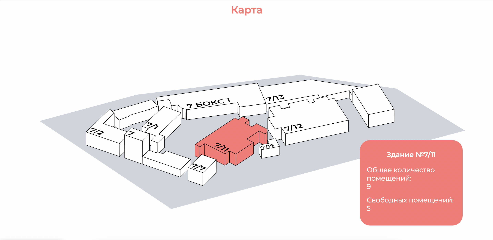
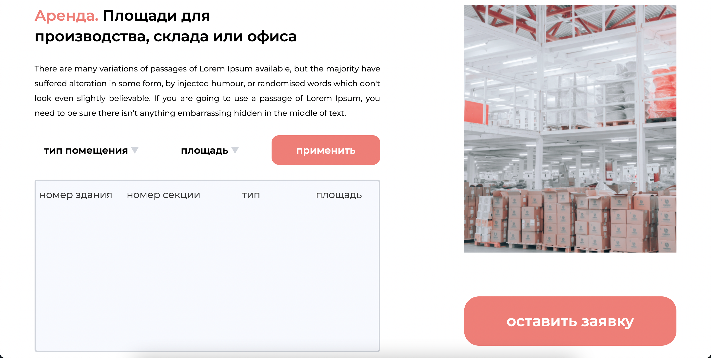

# Веб-сайт компании "Жилстрой"

Компания "Жилстрой"(г. Миасс) предоставляет производственные площади в аренду. 

Данный веб-сайт позволит улучшить качество обслуживания клиентов и повысить уровень доступности актуальной информации.

<br/>

## Основные разделы:
<br/>

###  **Интерактивная карта:**

<br/>

> обеспечивает возможность взаимодействия пользователей с объектами. Сделав клик на здание пользователь увидит общее количество и количество свободных помещений;

<br/>

 

<br/>

### **Поиск помещений:**

<br/>

> поиск помещений доступных для аренды с помощью выставленных фильтров;

> возможность оставить заявку на предоставление услуги аренды (данные формы возвращаются в настроенный административный телеграмм-чат);

<br/>

> 

<br/>

### **Поиск компаний-арендаторов:**

<br/>

> поиск местоположения выбранного арендатора на территории компании "Жилстрой"

<br/>


<br/>

## Сборка репозитория и локальный запуск

<br/>

### **Настройка** 

<br/>


Введите в консоль:


```
git clone https://github.com/Vixroff/LearnPython_project.git

python3 -m venv env

source env/bin/activate

pip install -r requirments.txt
```

<br/>

создайте файл .env и добавьте следующие значения

```
SECRET_KEY = 'ваш secret key'
YANDEX_API_KEY_MAP = 'API сервиса Яндекс.Карт'
TGBOT_TOKEN = "API ключ полученный у BotFather"
TGBOT_CHAT_ID = "ID административного чата"
```

<br/>

далее необходимо заполнить базу данных с помощью команды
```
python add_data.py
```

<br>

### **Запуск**

<br/>

```
flask run
```


